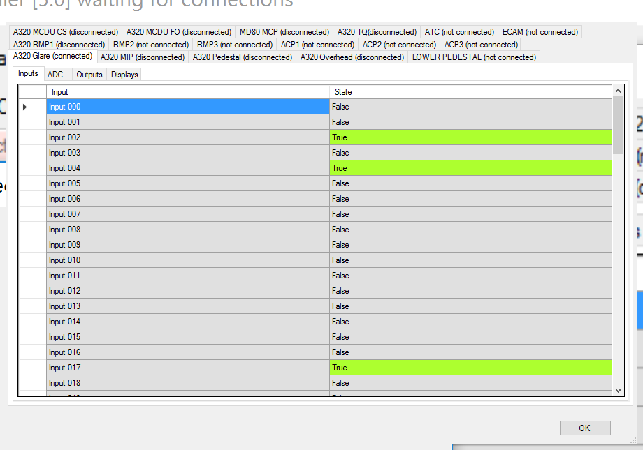
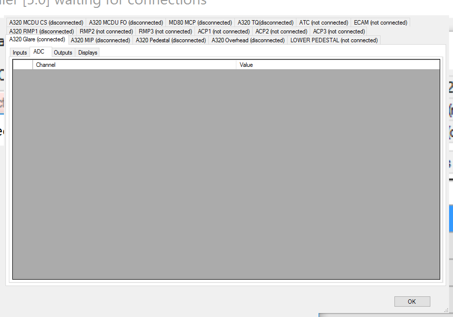
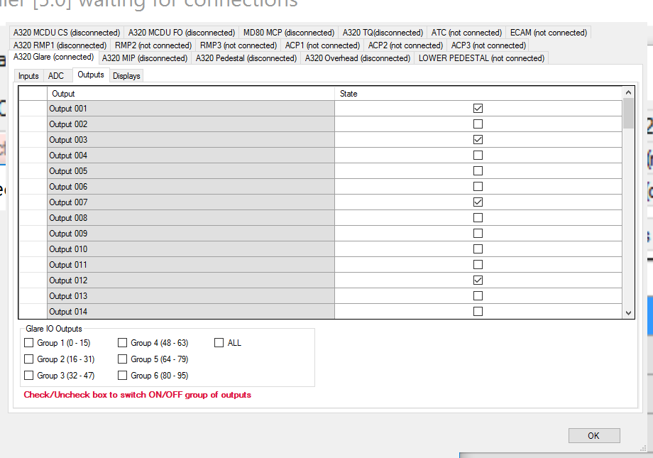
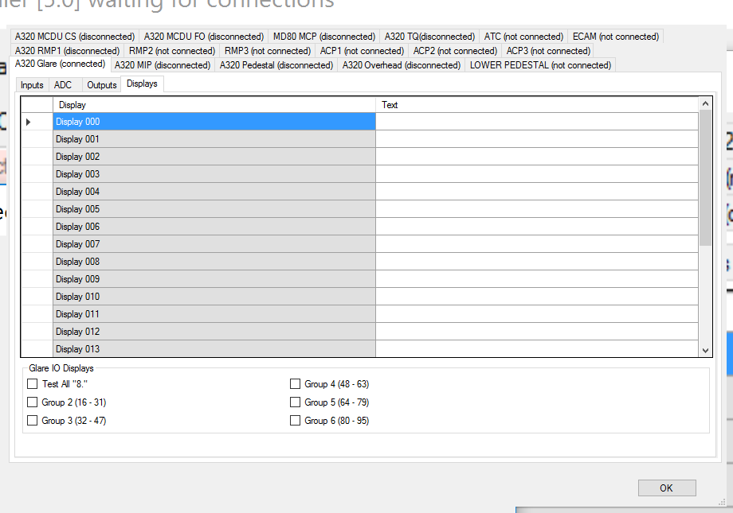

# Description du protocole USB du périphérique Skalarki Flight Control Unit

La société Skalarki produit des périphérique USB pour réaliser par soi-même des cockpits pour des simulateurs d'Airbus A320. Chaque module 
correspond à l'une des parties du cockpit. 

Le FCU (Flight Control Unit) correspond à ce que l'on appelle le pilote automatique. Il permet par exemple de régler une consigne pour un cap, une vitesse ou une altitude. 

Pour commencer l'exploration des périphériques Skalarki, le FCU est un bon candidat car il comporte des entrées (bouton, intérupteur, rotacteur, ...), des 
témoins lumineux et des afficheurs.

## Typologie des échanges
Dans le logiciel *SkalarkiIO Profiler 5*, les échanges avec le périphériques sont classé en quatre catégories : 
- **Inputs**
- **ADC**
- **Outputs**
- **Displays**

Les deux premières sont des entrées et les deux dernières des sorties.

### Inputs
Les **Inputs**, comme le nom l'indique correspond aux entrées des actionneurs simples (bouton, intérupteur, rotacteur, ...). 
Leur valeur est digitale, c'est à dire que dans qu'une entrée ne peut avoir que la valeur `true` ou `false`. Pour les actionneurs 
complexes avec plus de deux positions, le logiciel utilise plusieurs entrées différentes pour coder les positions.

Dans le cas du module FCU, il y a au total 96 inputs différentes.

### ADC
Les **ADC** correspondent à des entrées analogiques. Généralement ce sont des potentiometres ou des capteurs de position. 
La valeur est proportionnelle à la position.

Le FCU n'a aucun ADC donc pour le présent module nous n'irons pas plus loin sur l'analyse de ce type d'entrées.

### Outputs
Les **Outputs**, correspondent principalement à des voyants lumineux. Leur état est binaire (allumé, éteint). 

Dans le cas du module FCU, il y a au total 96 outputs différentes. Ils ont la particularité d'être groupés en 6 **GROUP** de 16 sorties. Dans le logiciel *SkalarkiIO Profiler 5*, ces groupes nous permettent d'activer 16 voyants en une seule opération. Dans la partie protocole la raison de ce groupement sera plus visible.

### Displays
Les témoins lumineux ne sont pas suffisants pour représenter toutes les informations affichables sur un cockpit. 
Dans un A320, il y a des afficheurs 7 segments pour rendre visibles ces informations. 

Le module FCU possède 24 afficheurs qui semblent eux aussi être arrangés en **GROUP** de 16 dans le logiciel. L'interaction sur ces groupes ne faisant rien, il n'est pas possible de comprendre en l'état l'utilité de cette fonctionnalité.

## Périphérique USB
Le Universal Serial Bus (USB) est une norme relative à un bus qui sert à connecter des périphériques. Le bus USB permet de connecter des périphériques à chaud (quand l'ordinateur est en marche). Apparu en 1996, ce connecteur s'est généralisé dans les années 2000 pour connecter souris, clavier d'ordinateur, imprimantes, clés USB et autres périphériques.

### Généralités
Cette norme étant très générale, elle comporte un certain nombre de niveau d'abstraction qui peuvent être déroutant en première lecture. Dans le cas du périphérique qui est le notre, on verra qu'une grande partie de cette complexité sera mise de coté car non indispensable. 

Sur le bus USB, il y a toujours un seul hôte et plusieurs périphériques.

#### Structure logique d'un périphérique USB
Dans la norme USB, un périphérique a une structure logique complexe. Il est découpé en une hiérarchie avec plusieurs niveau. Le premier niveau est le périphérique (Device). Un Device possède des configurations possibles. Chaque configuration va être associé à des Interfaces. Une interface est pour nous une sorte de périphérique logique. Pour communiquer avec ces interfaces, il est définit des point de terminaison (End point). Chaque End point est utilisé pour un et un seul type de transfert et dans un seul sens.

Pour expliquer au système ce que le périphérique est capable de faire, à chaque niveau logique est associé un type de descripteur. Cette organisation permet au périphérique physique de comporter plusieurs sous périphériques. Par exemple, pour une imprimante multifonction, un seul périphérique physique contient d'un point de vu logique un périphérique de capture d'image, un périphérique d'impression, un lecteur de cartes SD,... Dans un tel cas, l'organisation pourrait-être un simple Device, constitué d'une configuration et autant d'interfaces que de périphériques logiques. Pour chaque périphérique, des end-point correspondant à l'usage du périphérique.

#### Les descripteurs

##### Rôle des descripteurs 

Il existe sur le marché de nombreux périphériques USB. Les créateurs de la norme souhaitait s'adapter à un grand nombre de cas imaginable sans connaitre de manière exhaustive tous les périphériques USB existant sur terre. En plus le bus USB devant être plug and play, il fallait que le périphérique soit intérogeable de manière standard. Lorsqu'un périphérique est connecté, il doit fournir à l'hôte toutes les informations nécessaires à son identification. Ces informations sont appelé les descripteurs.

Les descripteurs sont regroupés en 4 catégorie correspondant au niveau de la structure logique d'un périphérique : 

- Device descriptor
- Configuration descriptor
- Interface descriptor 
- Endpoint descriptor

Pour mieux comprendre le but de ces descripteurs, tout en aidant à l'objectif du p, l'exemple du FCU va être utilisé.

##### Device descriptor

##### Configuration descriptor

##### Interface descriptor

##### Endpoint descriptor

#### Contrôle et configuration d'un périphérique

Avant d'aller dans les détails, l'hôte reconnaît et installe un appareil lorsque vous le branchez. Lorsque vous branchez un périphérique USB, l'hôte sait (en raison d'une astuce electronique), qu'un dispositif a été branché.

L'hôte signale une réinitialisation USB à l'appareil, afin de garantir un état connu à la fin de la remise à zéro. Dans cet état, le dispositif répond à l'adresse par défaut 0. Jusqu'à ce que le dispositif soit réinitialisé, l'hôte empêche les données d'être envoyé. Il ne réinitialise un seul appareil à la fois, donc il n'y a aucun danger que deux dispositifs puissent répondre à l'adresse 0.

L'hôte va ensuite envoyer une demande au endpoint 0, l'adresse de l'appareil 0 à savoir sa taille maximale de paquet. Il peut découvrir cela en utilisant la commande `Get Descriptor (Device)`.

En règle générale, l'hôte réinitialisent maintenant à nouveau le dispositif. Il envoie alors une demande d'adresses, avec une adresse unique. Après cette requête, l'appareil prend une nouvelle adresse. A ce stade, l'hôte est  libre de réinitialiser d'autres appareils récemment branchés.

Typiquement, l'hôte va maintenant commencer à interroger le dispositif pour obtenir autant de détails que nécéssaire. 
Pour ce faire, il va envoyer l'une des requête suivante :

- Get Device Descriptor
- Get Configuration Descriptor
- Get String Descriptor

Quand le dispositif est dans un état adressé, mais non configuré, et est autorisé à répondre aux demandes standard. Une fois que l'hôte a récupéré l'ensemble de ces données, il va charger le pilote de périphérique approprié. Le pilote de périphérique envoie une configuration à l'appareil, avec une requête `Set Configuration`. Le dispositif est maintenant dans l'état configuré, et peut commencer à être utilisé. Désormais, il peut répondre à des demandes spécifiques, en plus des demandes standards vu précédement.

Dans la norme USB, il y a quatre types de transfert différents:
- Transferts de contrôle
- Transferts d'interruption
- Transferts en vrac
- Transferts isochrones

Le seul type de transfert disponible pour un périphérique non configuré est le transfert de contrôle. 
